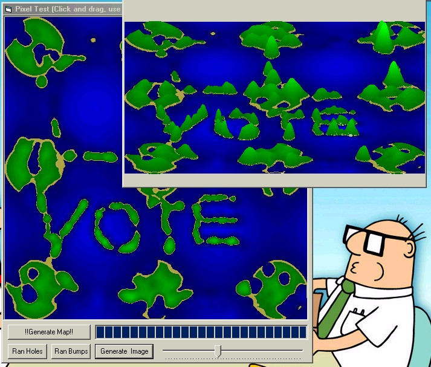



## Deformable Landscape 2

### Description

This program creates a landscape which can be raised or lowered, but now it will make a '3d' image of the landscape. Also I have increased the speed. It is very enjoyable and entertaining...
 
### More Info
 

             |
---                |---
**Submitted On**   |2002-08-16 19:20:32
**By**             |[Kevin Pfister](https://github.com/Planet-Source-Code/PSCIndex/blob/master/ByAuthor/kevin-pfister.md)
**Level**          |Intermediate
**User Rating**    |5.0 (25 globes from 5 users)
**Compatibility**  |VB 6\.0
**Category**       |[Graphics](https://github.com/Planet-Source-Code/PSCIndex/blob/master/ByCategory/graphics__1-46.md)
**World**          |[Visual Basic](https://github.com/Planet-Source-Code/PSCIndex/blob/master/ByWorld/visual-basic.md)
**Archive File**   |[Deformable1189978162002\.zip](https://github.com/Planet-Source-Code/kevin-pfister-deformable-landscape-2__1-38015/archive/master.zip)

